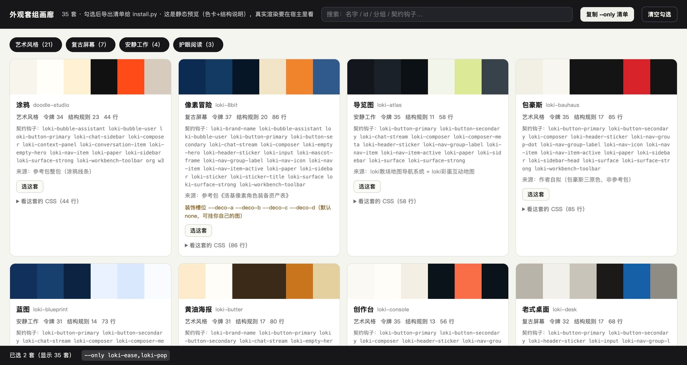

# Loki 外观套组工坊（loki-theme-kit）

**35 套现成的界面外观主题**，一行接入就全部可用；不满意，就用同一套方法从一张参考图做自己的。

> 作者：**Loki**（lokimao2046@gmail.com）· MIT 许可，可自由使用、改造、商用。



## 给 Agent（推荐路径）

```bash
python3 scripts/auto.py --project /path/to/your/app
```

它会自己认出宿主类型（Next.js App Router / Vite / 纯 HTML）、打好接入包、把
`<script>` 插到正确位置（改文件前留备份、重复跑不重复插）、然后**回读验证**并打印
三行 ✓。跑完用户那边就已经有 35 套主题了——右下角「外观」按钮，随便切，选择被记住。

**装完会自动弹一页说明**（`给你的用户.html`）—— 一次说清"现在能用什么、还想要什么该说哪句话、
重启升级会不会掉、想自己做怎么办"。不要弹就加 `--no-open`。

不要问用户一堆问题再动手；默认就是 35 套全带。控制参数：
`--sets recommended`（10 套）/ `--sets loki-ease,loki-pop` / `--no-switcher` / `--dry-run`。

### 宿主改不了源码 / 界面里没有可认领的元素？

改不了源码的宿主（Electron 桌面 App 之类）走运行时注入：

```bash
python3 scripts/adapt.py --host cola --port 9333 --install --css out/loki-themes.css
```

还有一件事得说清楚：**颜色和结构件是两层**。颜色靠令牌就能过；结构件（纸面纹理、
贴纸圆边、撕口、计数器编号、扫描线……）挂在 `.loki-*` 钩子上，别人的宿主里没有这些钩子
—— 那就**给它们的真实元素挂上**：

```bash
python3 scripts/probe.py --port 9333                          # 盘点宿主，出角色候选
python3 scripts/adapt.py --host cola --port 9333 --check      # 逐条实测
python3 scripts/adapt.py --host cola --port 9333 --triage --apply  # 哪个钩子会弄坏排版
python3 scripts/adapt.py --host cola --port 9333 --verify     # 结构件到了多少
```

宿主升级后只需要一条命令：`adapt.py --host cola --port 9333 --refresh --apply`。

**重启 / 升级之后怎么拿回来**：先存一次档案（`scripts/profile.py save --name <名字> --port 9333`），
之后对 Agent 说一句「把外观恢复回来」就够了（Agent 跑 `profile.py restore --name <名字>`）。
想只要几套就 `profile.py sets --name <名字> --only loki-ease,loki-pop`，其余的会从他的界面上走掉。

**不想每次叫 Agent**：`scripts/profile.py autostart` 装一个常驻守护，宿主一启动外观就自己回来
（`autostart --off` 一条命令卸掉，配置进废纸篓可恢复）。
方法、判定标准和真实数字见 [`references/host-binding.md`](references/host-binding.md)。

## 给人

```bash
python3 scripts/start.py          # 向导，回车到底
```

默认也是生成一个自包含文件，你只要在页面里加一行：

```html
<script src="./loki-themes/loki-themes.js"></script>
```

完。删掉那一行就全部还原。

## 先看效果（不用装任何东西）

```bash
open previews/dropin/index.html   # 一行接入的示例页（那张页面本身没有任何样式）
open previews/demo/demo.html      # 深度接入的参考宿主
open previews/gallery.html        # 画廊：每套的色卡、结构特征、来源
```

## 第一次用？看这两份

| 你是谁 | 看这个 |
| --- | --- |
| 完全没接触过主题系统 / 不想看术语 | [`references/quickstart.md`](references/quickstart.md) |
| 设计师：想从一张图做一套自己的 | [`references/quickstart.md`](references/quickstart.md) 的「给设计师」一节 + [`references/design-language.md`](references/design-language.md) |
| 工程师：接进已有项目 / 改契约 / 排查 | [`references/host-contract.md`](references/host-contract.md) + [`references/troubleshooting.md`](references/troubleshooting.md) |
| **装完该怎么跟用户交代** / 用户问"还能要什么" | [`references/after-install.md`](references/after-install.md) |

## 这包里有什么

```text
SKILL.md            给 Agent 的说明书（主路径：一条命令接好）
sets/               35 套主题（每套 theme.css + meta.json），含格式说明与来源
references/         9 份文档：白话上手 / 契约 / 装完之后（含给用户的那页能力清单）/ 结构件绑定 /
                    设计语言 / 质量门 / 装饰位 / 护眼依据 / 踩坑
scripts/            auto.py（Agent 接入）start.py（向导）bundle.py（打接入包）install.py（深度接入）
                    check.py（质检）palette.py（从图取色）new-theme.py（起套组）gallery.py extract.py
                    probe.py + adapt.py（把结构件接进别人的宿主）inject-cdp.py（改不了源码的宿主）
templates/          主题模板 + 切换器组件（原生 JS / React）+ tagger.js + 参考宿主 + 接入包三层
previews/           画廊 / 一行接入示例页 / 深度接入演示页 / 真实宿主截图
```

## 三条不会破的承诺

1. **没有任何图片文件。** 35 套全是纯 CSS；装饰位是变量，默认空着，缺图不会破版。
2. **不含任何人的 IP 形象。** 换外观只换壳，不重画角色、不替换品牌位。
3. **不偷偷改你的项目。** 改任何文件前留 `.loki-bak-*` 备份；`--dry-run` 可以只看不动；
   一行接入随时删掉那一行就还原。

## 质检

```bash
python3 scripts/check.py          # 六道门，全过才叫做完（当前 35/35 通过）
```

量的是：令牌完整性、正文/辅助/强调的文字对比度、结构件数量（防"只是换个色"）、
护眼专项（禁纯白/禁纹理/禁动效）、零素材依赖。

## 许可

MIT（见 [LICENSE](LICENSE)）。**不含任何图片素材、不含任何人的 IP 形象** —— 装饰位留成变量，
你自己填自己的图。

## 作者

赛博小熊猫 Loki · lokimao2046@gmail.com

同系列：[ai-career-compass](https://github.com/loki2046-mao/ai-career-compass)（求职 AI 暴露度）·
[cine-type-poster-generator-skill](https://github.com/loki2046-mao/cine-type-poster-generator-skill)（电影字报）·
[self-mirror-skill](https://github.com/loki2046-mao/self-mirror-skill)（AI 自我画像）
